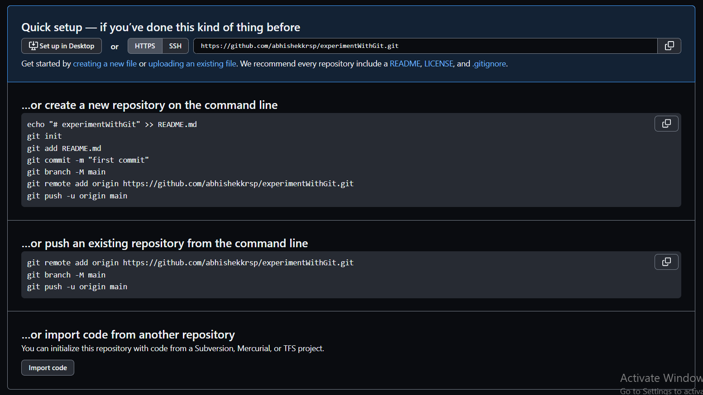

## Sets the author name and email address respectively to be used with your commits
>- Command: `git config –global user.name “[name]”`
>- Command: `git config –global user.email “[email address]”`

## To start a new repository
>- Command:  `git init [repository name]`

## To obtain a repository from an existing URL
>- Command:  `git clone [url]`

## Adds a file to the staging area
>- Command:  `git add [file]`

## **_To connect your local repository to the remote server_**
>- Command:    `git remote add [variable name] [Remote Server Link]`

## Records the file permanently in the version history
>- Command:  `git commit -m “[ Type in the commit message]” `

## lists all the local branches in the current repository
>- Command:   `git branch`

## To create new branch
>- Command:   `git branch [branch name]`

## To delete branch
>- Command:   `git branch -d [branch name]`

## Switch from one branch to other
>- Command:    `git checkout [branch name]`

## Switch from one branch to new branch
>- Command:   `git checkout -b [branch name]`

## Merging the branch history to current one
>- Command:    `git merge [branch name]`

## To send the branch commits to our remote repository
>- Command:   `git push [variable name] [branch name]`

## To send all branch commits to our remote repository
>- Command:    `git push –all [variable name]`

## To delete branch on remote repository
>- Command     `git push [variable name] :[branch name]`

## To fetch and merge changes on remote server to local repository
>- Command:    `git pull [Repository Link]`

## To delete the file from your working directory and stages the deletion
>- Command:    `git rm [file]`

- Refrences:--
    - https://www.javatpoint.com/git-commands

# experimentWithGit
